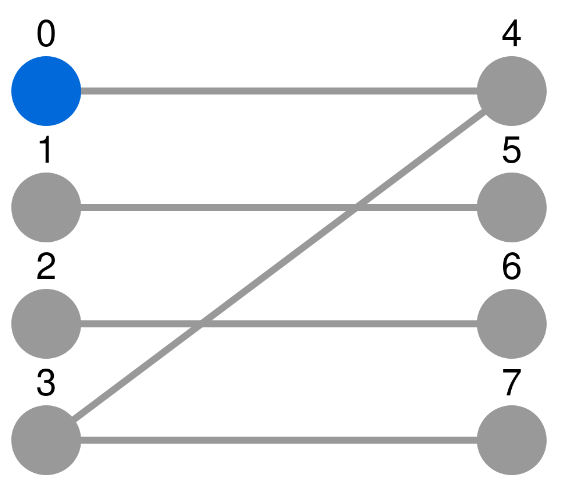

# Dash-Bipartite

## Description

Dash-Bipartite contains tools to create two columns graphs and bipartite graphs dash components.



## Installation

Since there's no package hosted on PyPi package yet, the package can be installed from source this way:

```console
(venv) [user@deskop ~]$ pip install --user git+https://github.com/sondalex/dash-bipartite.git@<github-release-version/sha commit id>
```


## How to use

```python
from dash import Dash
from dash import html
from dash.dependencies import Input, Output, State
from dash_bipartite.bipartite import from_pandas_edgelist, BipartiteCytoscape
import pandas as pd

df = pd.DataFrame({"A": [0, 1, 2, 3, 3], "B": [4, 5, 6, 7, 4]})

G = from_pandas_edgelist(df=df, source="A", target="B")
nodes_dict = {node: {"label": str(node), "grabbable": False} for node in G.nodes}
edges_dict = {(key1, key2): {"selectable": False} for key1, key2 in G.edges}
plotly_component = BipartiteCytoscape(
    G,
    nodes_supplementary_parameters=nodes_dict,
    edges_supplementary_parameters=edges_dict,
    id='bipartite-network',scale=100
)

app = Dash(__name__)
app.layout = html.Div([
    plotly_component
])

app.run_server(debug=True)
```

`BipartiteCytoscape` is a children class of `dash_cytoscape.Cytoscape`. Therefore, refer to https://dash.plotly.com/cytoscape
for more detailed information.

## Demo

To see it in action, a demo is available in the repository:
https://github.com/sondalex/dash-bipartite/blob/master/demo/app-bipartite-graph.py

To run the demo:

Install the package, clone the repository and run:

```console
(venv) [user@desktop ~]$ cd <path_to_repository>
(venv) [user@desktop dash-bipartite]$ python demo/app-bipartite-graph.py
```
